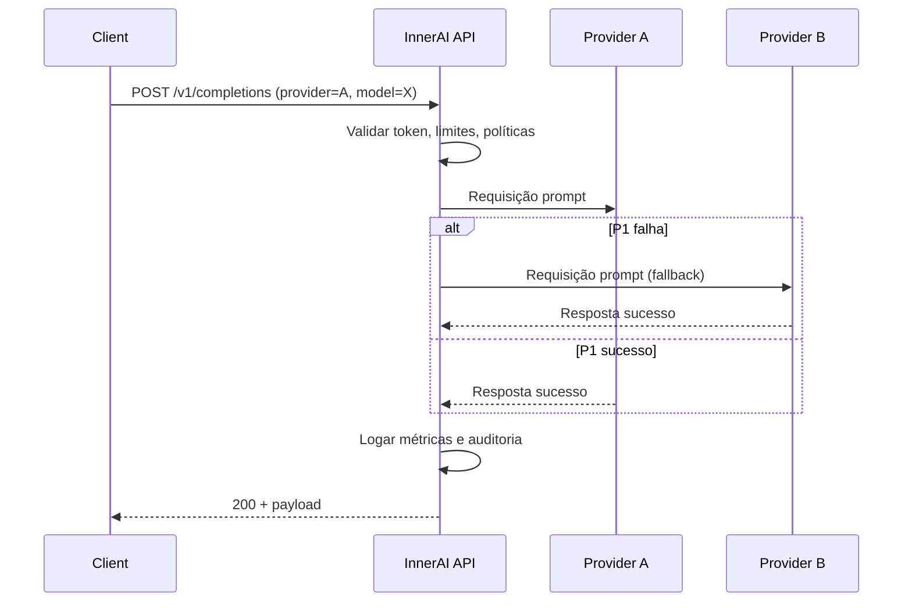

# Sequências (Mermaid)

## Chamada de Completion com Fallback

```mermaid
sequenceDiagram
  participant C as Client
  participant A as InnerAI API
  participant P1 as Provider A
  participant P2 as Provider B

  C->>A: POST /v1/completions (provider=A, model=X)
  A->>A: Validar token, limites, políticas
  A->>P1: Requisição prompt
  alt P1 falha
    A->>P2: Requisição prompt (fallback)
    P2-->>A: Resposta sucesso
  else P1 sucesso
    P1-->>A: Resposta sucesso
  end
  A->>A: Logar métricas e auditoria
  A-->>C: 200 + payload
```
